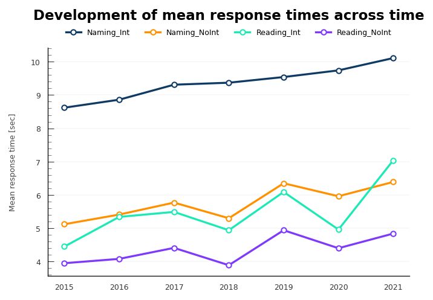

# Lab 03: Fun with `pandas`!

Below are some exercises to get you working with `pandas` to manipulate data. As always, get as far as you can, and ask for help when you need it! Your teacher (me), you instructor, and your classmates are all here to help each other get better at coding. Getting the code to work is important, but do also take the time to make sure you understand what the commands are doing. This time, (with the exception of the Stroop challenge), all I've given you is the code to download the data. Then you are on your own. For the Stroop challenge, I gave the you code for the first step—after that, it's up to you :-)


```python
import pandas as pd
```

## Music sales challenge

Write a script that:

1. Combines the tables of best-selling physical singles and best-selling digital singles on the Wikipedia page "List_of_best-selling_singles"
2. Adds a column which marks whether each row is from the list of physical singles or digital singles
3. Outputs the artist and single name for the year you were born. If there is no entry for that year, take the closest year after you were born.
4. Outputs the artist and single name for the year you were 15 years old.


```python
tables = pd.read_html("https://en.wikipedia.org/wiki/List_of_best-selling_singles")
physical = pd.concat([tables[0], tables[1]])
digital = pd.concat([tables[3], tables[4]])

physical["Medium"] = "physical"
digital["Medium"] = "digital"

dataset = pd.concat([physical, digital]).reset_index(drop=True)
dataset
```


<div>
<style scoped>
    .dataframe tbody tr th:only-of-type {
        vertical-align: middle;
    }

    .dataframe tbody tr th {
        vertical-align: top;
    }

    .dataframe thead th {
        text-align: right;
    }
</style>
<table border="1" class="dataframe">
  <thead>
    <tr style="text-align: right;">
      <th></th>
      <th>Artist</th>
      <th>Single</th>
      <th>Released</th>
      <th>Sales (in millions)</th>
      <th>Source</th>
      <th>Medium</th>
    </tr>
  </thead>
  <tbody>
    <tr>
      <th>0</th>
      <td>Bing Crosby</td>
      <td>"White Christmas"</td>
      <td>1942</td>
      <td>50</td>
      <td>[1]</td>
      <td>physical</td>
    </tr>
    <tr>
      <th>1</th>
      <td>Elton John</td>
      <td>"Something About the Way You Look Tonight"/"Ca...</td>
      <td>1997</td>
      <td>33</td>
      <td>[1]</td>
      <td>physical</td>
    </tr>
    <tr>
      <th>2</th>
      <td>Bing Crosby</td>
      <td>"Silent Night"</td>
      <td>1935</td>
      <td>30</td>
      <td>[2]</td>
      <td>physical</td>
    </tr>
    <tr>
      <th>3</th>
      <td>Tino Rossi</td>
      <td>"Petit Papa Noël"</td>
      <td>1946</td>
      <td>30</td>
      <td>[3]</td>
      <td>physical</td>
    </tr>
    <tr>
      <th>4</th>
      <td>Bill Haley &amp; His Comets</td>
      <td>"Rock Around the Clock"</td>
      <td>1954</td>
      <td>25</td>
      <td>[4][5]</td>
      <td>physical</td>
    </tr>
    <tr>
      <th>...</th>
      <td>...</td>
      <td>...</td>
      <td>...</td>
      <td>...</td>
      <td>...</td>
      <td>...</td>
    </tr>
    <tr>
      <th>100</th>
      <td>Bruno Mars</td>
      <td>"Grenade"</td>
      <td>2010</td>
      <td>10.2</td>
      <td>[68]</td>
      <td>digital</td>
    </tr>
    <tr>
      <th>101</th>
      <td>Mike Posner</td>
      <td>"I Took a Pill in Ibiza"</td>
      <td>2015</td>
      <td>10[a]</td>
      <td>[51]</td>
      <td>digital</td>
    </tr>
    <tr>
      <th>102</th>
      <td>Shakira featuring Freshlyground</td>
      <td>"Waka Waka (This Time for Africa)"</td>
      <td>2010</td>
      <td>10</td>
      <td>[77]</td>
      <td>digital</td>
    </tr>
    <tr>
      <th>103</th>
      <td>Shakira featuring Wyclef Jean</td>
      <td>"Hips Don't Lie"</td>
      <td>2006</td>
      <td>10</td>
      <td>[78]</td>
      <td>digital</td>
    </tr>
    <tr>
      <th>104</th>
      <td>Lady Gaga featuring Colby O'Donis</td>
      <td>"Just Dance"</td>
      <td>2008</td>
      <td>10</td>
      <td>[79]</td>
      <td>digital</td>
    </tr>
  </tbody>
</table>
<p>105 rows × 6 columns</p>
</div>


```python
dataset[dataset["Released"] == 1998][["Artist", "Single"]]
```


<div>
<style scoped>
    .dataframe tbody tr th:only-of-type {
        vertical-align: middle;
    }

    .dataframe tbody tr th {
        vertical-align: top;
    }

    .dataframe thead th {
        text-align: right;
    }
</style>
<table border="1" class="dataframe">
  <thead>
    <tr style="text-align: right;">
      <th></th>
      <th>Artist</th>
      <th>Single</th>
    </tr>
  </thead>
  <tbody>
    <tr>
      <th>25</th>
      <td>Cher</td>
      <td>"Believe"</td>
    </tr>
    <tr>
      <th>42</th>
      <td>Britney Spears</td>
      <td>"...Baby One More Time"</td>
    </tr>
  </tbody>
</table>
</div>


```python
dataset[dataset["Released"] == 1998 + 15][["Artist", "Single"]]
```


<div>
<style scoped>
    .dataframe tbody tr th:only-of-type {
        vertical-align: middle;
    }

    .dataframe tbody tr th {
        vertical-align: top;
    }

    .dataframe thead th {
        text-align: right;
    }
</style>
<table border="1" class="dataframe">
  <thead>
    <tr style="text-align: right;">
      <th></th>
      <th>Artist</th>
      <th>Single</th>
    </tr>
  </thead>
  <tbody>
    <tr>
      <th>65</th>
      <td>Robin Thicke featuring T.I. and Pharrell</td>
      <td>"Blurred Lines"</td>
    </tr>
    <tr>
      <th>69</th>
      <td>Pharrell Williams</td>
      <td>"Happy"</td>
    </tr>
    <tr>
      <th>74</th>
      <td>Katy Perry featuring Juicy J</td>
      <td>"Dark Horse"</td>
    </tr>
    <tr>
      <th>81</th>
      <td>John Legend</td>
      <td>"All of Me"</td>
    </tr>
    <tr>
      <th>89</th>
      <td>Avicii featuring Aloe Blacc</td>
      <td>"Wake Me Up"</td>
    </tr>
    <tr>
      <th>93</th>
      <td>Idina Menzel</td>
      <td>"Let It Go"</td>
    </tr>
    <tr>
      <th>99</th>
      <td>Lorde</td>
      <td>"Royals"</td>
    </tr>
  </tbody>
</table>
</div>


## Space challenge

1. Make a single dataframe that combines the space missions from the 1950's to the 2020's
2. Write a script that returns the year with the most launches
3. Write a script that returns the most common month for launches
4. Write a script that ranks the months from most launches to fewest launches


```python
tables = pd.read_html("https://en.wikipedia.org/wiki/Timeline_of_Solar_System_exploration", match= "Mission name")

dataset = pd.concat(tables)
dataset["Year"] = dataset["Launch date"].apply(lambda date: int(date.split(" ")[-1]))
dataset["Month"] = dataset["Launch date"].apply(lambda date: date.split(" ")[-2])
dataset["Decade"] = dataset["Year"].apply(lambda year: str(10 * (year // 10)) + "s")
dataset
```


<div>
<style scoped>
    .dataframe tbody tr th:only-of-type {
        vertical-align: middle;
    }

    .dataframe tbody tr th {
        vertical-align: top;
    }

    .dataframe thead th {
        text-align: right;
    }
</style>
<table border="1" class="dataframe">
  <thead>
    <tr style="text-align: right;">
      <th></th>
      <th>Mission name</th>
      <th>Launch date</th>
      <th>Description</th>
      <th>Ref(s)</th>
      <th>Year</th>
      <th>Month</th>
      <th>Decade</th>
    </tr>
  </thead>
  <tbody>
    <tr>
      <th>0</th>
      <td>Sputnik 1</td>
      <td>4 October 1957</td>
      <td>First Earth orbiter</td>
      <td>[1][2]</td>
      <td>1957</td>
      <td>October</td>
      <td>1950s</td>
    </tr>
    <tr>
      <th>1</th>
      <td>Sputnik 2</td>
      <td>3 November 1957</td>
      <td>Earth orbiter, first animal in orbit, a dog na...</td>
      <td>[2][3][4]</td>
      <td>1957</td>
      <td>November</td>
      <td>1950s</td>
    </tr>
    <tr>
      <th>2</th>
      <td>Explorer 1</td>
      <td>1 February 1958</td>
      <td>Earth orbiter; discovered Van Allen radiation ...</td>
      <td>[5]</td>
      <td>1958</td>
      <td>February</td>
      <td>1950s</td>
    </tr>
    <tr>
      <th>3</th>
      <td>Vanguard 1</td>
      <td>17 March 1958</td>
      <td>Earth orbiter; oldest spacecraft still in Eart...</td>
      <td>[6]</td>
      <td>1958</td>
      <td>March</td>
      <td>1950s</td>
    </tr>
    <tr>
      <th>4</th>
      <td>Luna 1</td>
      <td>2 January 1959</td>
      <td>First lunar flyby (attempted lunar impact?); f...</td>
      <td>[7][8][9][10]</td>
      <td>1959</td>
      <td>January</td>
      <td>1950s</td>
    </tr>
    <tr>
      <th>...</th>
      <td>...</td>
      <td>...</td>
      <td>...</td>
      <td>...</td>
      <td>...</td>
      <td>...</td>
      <td>...</td>
    </tr>
    <tr>
      <th>18</th>
      <td>Peregrine Mission One (including Iris and Colm...</td>
      <td>8 January 2024</td>
      <td>Lunar lander and rovers (landing precluded)</td>
      <td>[504]</td>
      <td>2024</td>
      <td>January</td>
      <td>2020s</td>
    </tr>
    <tr>
      <th>19</th>
      <td>IM-1 Nova-C Odysseus (including EagleCam deplo...</td>
      <td>15 February 2024</td>
      <td>Lunar landers</td>
      <td>[505]</td>
      <td>2024</td>
      <td>February</td>
      <td>2020s</td>
    </tr>
    <tr>
      <th>20</th>
      <td>DRO A/B</td>
      <td>13 March 2024</td>
      <td>Lunar orbiters</td>
      <td>[506]</td>
      <td>2024</td>
      <td>March</td>
      <td>2020s</td>
    </tr>
    <tr>
      <th>21</th>
      <td>Queqiao-2 (including Tiandu-1 and 2)</td>
      <td>20 March 2024</td>
      <td>Lunar orbiters</td>
      <td>[507]</td>
      <td>2024</td>
      <td>March</td>
      <td>2020s</td>
    </tr>
    <tr>
      <th>22</th>
      <td>Chang'e 6 (including Pakistan's ICUBE-Q cubesat)</td>
      <td>3 May 2024</td>
      <td>Lunar sample return, rover and orbiters; first...</td>
      <td>[508][509]</td>
      <td>2024</td>
      <td>May</td>
      <td>2020s</td>
    </tr>
  </tbody>
</table>
<p>233 rows × 7 columns</p>
</div>


```python
dataset.value_counts("Year").idxmax()
```


    1965


```python
dataset.value_counts("Month").idxmax()
```


    'November'


```python
dataset.value_counts("Month").rename("Occurences").to_frame()
```


<div>
<style scoped>
    .dataframe tbody tr th:only-of-type {
        vertical-align: middle;
    }

    .dataframe tbody tr th {
        vertical-align: top;
    }

    .dataframe thead th {
        text-align: right;
    }
</style>
<table border="1" class="dataframe">
  <thead>
    <tr style="text-align: right;">
      <th></th>
      <th>Occurences</th>
    </tr>
    <tr>
      <th>Month</th>
      <th></th>
    </tr>
  </thead>
  <tbody>
    <tr>
      <th>November</th>
      <td>30</td>
    </tr>
    <tr>
      <th>August</th>
      <td>27</td>
    </tr>
    <tr>
      <th>October</th>
      <td>22</td>
    </tr>
    <tr>
      <th>September</th>
      <td>22</td>
    </tr>
    <tr>
      <th>July</th>
      <td>21</td>
    </tr>
    <tr>
      <th>December</th>
      <td>19</td>
    </tr>
    <tr>
      <th>January</th>
      <td>19</td>
    </tr>
    <tr>
      <th>May</th>
      <td>17</td>
    </tr>
    <tr>
      <th>March</th>
      <td>15</td>
    </tr>
    <tr>
      <th>February</th>
      <td>14</td>
    </tr>
    <tr>
      <th>June</th>
      <td>14</td>
    </tr>
    <tr>
      <th>April</th>
      <td>13</td>
    </tr>
  </tbody>
</table>
</div>


## Supervillain challenge

1. Write a script that combines the tables showing supervillain debuts from the 30's through the 2010's
2. Write a script that ranks each decade in terms of how many supervillains debuted in that decade
3. Write a script that ranks the different comics companies in terms of how many supervillains they have, and display the results in a nice table (pandas dataframe)


```python
tables = pd.read_html("https://en.wikipedia.org/wiki/List_of_comic_book_supervillain_debuts", match= "Character / Team")
dataset = pd.concat(tables)

dataset["Year"] = dataset["Year Debuted"].str.extract("(\d{4})").astype(int)
dataset["Decade"] = dataset["Year"].apply(lambda year: str(10 * (year // 10)) + "s")

dataset
```


<div>
<style scoped>
    .dataframe tbody tr th:only-of-type {
        vertical-align: middle;
    }

    .dataframe tbody tr th {
        vertical-align: top;
    }

    .dataframe thead th {
        text-align: right;
    }
</style>
<table border="1" class="dataframe">
  <thead>
    <tr style="text-align: right;">
      <th></th>
      <th>Character / Team</th>
      <th>Year Debuted</th>
      <th>Company</th>
      <th>Creator/s</th>
      <th>First Appearance</th>
      <th>Year</th>
      <th>Decade</th>
    </tr>
  </thead>
  <tbody>
    <tr>
      <th>0</th>
      <td>Ultra-Humanite</td>
      <td>1939 (June)</td>
      <td>DC</td>
      <td>Jerry Siegel, Joe Shuster</td>
      <td>Action Comics (vol. 1) #13</td>
      <td>1939</td>
      <td>1930s</td>
    </tr>
    <tr>
      <th>1</th>
      <td>Dr. Death</td>
      <td>1939 (July)</td>
      <td>DC</td>
      <td>Bob Kane, Bill Finger</td>
      <td>Detective Comics (vol. 1) #29</td>
      <td>1939</td>
      <td>1930s</td>
    </tr>
    <tr>
      <th>2</th>
      <td>The Monk</td>
      <td>1939 (September)</td>
      <td>DC</td>
      <td>Bob Kane, Bill Finger</td>
      <td>Detective Comics (vol. 1) #31</td>
      <td>1939</td>
      <td>1930s</td>
    </tr>
    <tr>
      <th>3</th>
      <td>The Claw</td>
      <td>1939 (December)</td>
      <td>Lev Gleason Publications</td>
      <td>Jack Cole</td>
      <td>Silver Streak Comics #1</td>
      <td>1939</td>
      <td>1930s</td>
    </tr>
    <tr>
      <th>0</th>
      <td>Hath-Set</td>
      <td>1940 (January)</td>
      <td>DC</td>
      <td>Gardner Fox, Dennis Neville</td>
      <td>Flash Comics #1</td>
      <td>1940</td>
      <td>1940s</td>
    </tr>
    <tr>
      <th>...</th>
      <td>...</td>
      <td>...</td>
      <td>...</td>
      <td>...</td>
      <td>...</td>
      <td>...</td>
      <td>...</td>
    </tr>
    <tr>
      <th>4</th>
      <td>Bloodwork</td>
      <td>2016 (August)</td>
      <td>DC</td>
      <td>Brian Buccellato</td>
      <td>The Flash #28</td>
      <td>2016</td>
      <td>2010s</td>
    </tr>
    <tr>
      <th>5</th>
      <td>Godspeed</td>
      <td>2016 (August)</td>
      <td>DC</td>
      <td>Joshua Williamson, Carmine Di Giandomenico</td>
      <td>The Flash: Rebirth #1</td>
      <td>2016</td>
      <td>2010s</td>
    </tr>
    <tr>
      <th>6</th>
      <td>The Hamster (Mr. Hansen)</td>
      <td>2017</td>
      <td>Disney/Hyperion</td>
      <td>Rhode Montijo</td>
      <td>The Gumazing Gum Girl! Book 2: Gum Luck</td>
      <td>2017</td>
      <td>2010s</td>
    </tr>
    <tr>
      <th>7</th>
      <td>The Underhander</td>
      <td>2019</td>
      <td>Disney/Hyperion</td>
      <td>Rhode Montijo</td>
      <td>The Gumazing Gum Girl! Book 4: Cover Blown!</td>
      <td>2019</td>
      <td>2010s</td>
    </tr>
    <tr>
      <th>8</th>
      <td>The Cocodrilos</td>
      <td>2019</td>
      <td>Disney/Hyperion</td>
      <td>Rhode Montijo</td>
      <td>The Gumazing Gum Girl! Book 4: Cover Blown!</td>
      <td>2019</td>
      <td>2010s</td>
    </tr>
  </tbody>
</table>
<p>636 rows × 7 columns</p>
</div>


```python
dataset["Decade"].value_counts().rename("Debuts").to_frame()
```


<div>
<style scoped>
    .dataframe tbody tr th:only-of-type {
        vertical-align: middle;
    }

    .dataframe tbody tr th {
        vertical-align: top;
    }

    .dataframe thead th {
        text-align: right;
    }
</style>
<table border="1" class="dataframe">
  <thead>
    <tr style="text-align: right;">
      <th></th>
      <th>Debuts</th>
    </tr>
  </thead>
  <tbody>
    <tr>
      <th>1960s</th>
      <td>228</td>
    </tr>
    <tr>
      <th>1970s</th>
      <td>97</td>
    </tr>
    <tr>
      <th>1980s</th>
      <td>92</td>
    </tr>
    <tr>
      <th>1990s</th>
      <td>84</td>
    </tr>
    <tr>
      <th>2000s</th>
      <td>49</td>
    </tr>
    <tr>
      <th>1940s</th>
      <td>47</td>
    </tr>
    <tr>
      <th>1950s</th>
      <td>26</td>
    </tr>
    <tr>
      <th>2010s</th>
      <td>9</td>
    </tr>
    <tr>
      <th>1930s</th>
      <td>4</td>
    </tr>
  </tbody>
</table>
</div>


```python
dataset.groupby("Company")["Character / Team"].count().sort_values(ascending = False).rename("Characters").to_frame()
```


<div>
<style scoped>
    .dataframe tbody tr th:only-of-type {
        vertical-align: middle;
    }

    .dataframe tbody tr th {
        vertical-align: top;
    }

    .dataframe thead th {
        text-align: right;
    }
</style>
<table border="1" class="dataframe">
  <thead>
    <tr style="text-align: right;">
      <th></th>
      <th>Characters</th>
    </tr>
    <tr>
      <th>Company</th>
      <th></th>
    </tr>
  </thead>
  <tbody>
    <tr>
      <th>DC</th>
      <td>338</td>
    </tr>
    <tr>
      <th>Marvel</th>
      <td>264</td>
    </tr>
    <tr>
      <th>Fawcett Comics/DC</th>
      <td>6</td>
    </tr>
    <tr>
      <th>Dark Horse</th>
      <td>5</td>
    </tr>
    <tr>
      <th>Image</th>
      <td>5</td>
    </tr>
    <tr>
      <th>Disney/Hyperion</th>
      <td>4</td>
    </tr>
    <tr>
      <th>Marvel/Timely</th>
      <td>4</td>
    </tr>
    <tr>
      <th>Eternity</th>
      <td>3</td>
    </tr>
    <tr>
      <th>Comico</th>
      <td>1</td>
    </tr>
    <tr>
      <th>Image Comics</th>
      <td>1</td>
    </tr>
    <tr>
      <th>Lev Gleason Publications</th>
      <td>1</td>
    </tr>
    <tr>
      <th>Mirage</th>
      <td>1</td>
    </tr>
  </tbody>
</table>
</div>


## Stroop challenge

Every year between 2015 and 2021, the students in my Language, Cognition, and the Brain-course participated in a version of the Stroop task. Using a stopwatch (ok, using their phones), they recorded how fast they could say a list of things (either reading or naming colors or color words). The column names mean "Reading with No Interference", "Naming with Interference", "Naming with No Interference", and "Reading with Interference". The times are in seconds.

### Stroop challenge 1: 
Transform these data from wide format to long format, so that the result is a dataframe with
- 1 column named "Participant_id" with a unique number for each participant (you can use the row indices)
- 1 column named "Year" with the year data
- 1 column named "Task" that shows which task they were doing
- 1 column named "RT" that shows their response time


```python
dataset = pd.read_csv("https://raw.githubusercontent.com/ethanweed/Stroop/master/Stroop-raw-over-the-years.csv")
dataset
```


<div>
<style scoped>
    .dataframe tbody tr th:only-of-type {
        vertical-align: middle;
    }

    .dataframe tbody tr th {
        vertical-align: top;
    }

    .dataframe thead th {
        text-align: right;
    }
</style>
<table border="1" class="dataframe">
  <thead>
    <tr style="text-align: right;">
      <th></th>
      <th>Reading_NoInt</th>
      <th>Naming_Int</th>
      <th>Naming_NoInt</th>
      <th>Reading_Int</th>
      <th>Year</th>
    </tr>
  </thead>
  <tbody>
    <tr>
      <th>0</th>
      <td>4.16</td>
      <td>6.76</td>
      <td>4.45</td>
      <td>4.65</td>
      <td>2015</td>
    </tr>
    <tr>
      <th>1</th>
      <td>4.35</td>
      <td>7.73</td>
      <td>4.78</td>
      <td>4.46</td>
      <td>2015</td>
    </tr>
    <tr>
      <th>2</th>
      <td>3.60</td>
      <td>7.00</td>
      <td>4.00</td>
      <td>3.50</td>
      <td>2015</td>
    </tr>
    <tr>
      <th>3</th>
      <td>3.90</td>
      <td>9.03</td>
      <td>4.60</td>
      <td>6.30</td>
      <td>2015</td>
    </tr>
    <tr>
      <th>4</th>
      <td>4.22</td>
      <td>9.98</td>
      <td>6.83</td>
      <td>6.24</td>
      <td>2015</td>
    </tr>
    <tr>
      <th>...</th>
      <td>...</td>
      <td>...</td>
      <td>...</td>
      <td>...</td>
      <td>...</td>
    </tr>
    <tr>
      <th>177</th>
      <td>4.30</td>
      <td>7.08</td>
      <td>6.25</td>
      <td>4.28</td>
      <td>2021</td>
    </tr>
    <tr>
      <th>178</th>
      <td>4.75</td>
      <td>9.66</td>
      <td>6.12</td>
      <td>5.49</td>
      <td>2021</td>
    </tr>
    <tr>
      <th>179</th>
      <td>4.98</td>
      <td>7.52</td>
      <td>6.73</td>
      <td>5.16</td>
      <td>2021</td>
    </tr>
    <tr>
      <th>180</th>
      <td>5.16</td>
      <td>8.81</td>
      <td>8.19</td>
      <td>5.51</td>
      <td>2021</td>
    </tr>
    <tr>
      <th>181</th>
      <td>4.27</td>
      <td>10.40</td>
      <td>5.32</td>
      <td>4.59</td>
      <td>2021</td>
    </tr>
  </tbody>
</table>
<p>182 rows × 5 columns</p>
</div>


```python
dataset_long = pd.melt(
    dataset.reset_index(names = "Participant_ID"), 
    id_vars=("Participant_ID", "Year")
).rename(columns = dict(variable = "Task", value = "RT"))

dataset_long
```


<div>
<style scoped>
    .dataframe tbody tr th:only-of-type {
        vertical-align: middle;
    }

    .dataframe tbody tr th {
        vertical-align: top;
    }

    .dataframe thead th {
        text-align: right;
    }
</style>
<table border="1" class="dataframe">
  <thead>
    <tr style="text-align: right;">
      <th></th>
      <th>Participant_ID</th>
      <th>Year</th>
      <th>Task</th>
      <th>RT</th>
    </tr>
  </thead>
  <tbody>
    <tr>
      <th>0</th>
      <td>0</td>
      <td>2015</td>
      <td>Reading_NoInt</td>
      <td>4.16</td>
    </tr>
    <tr>
      <th>1</th>
      <td>1</td>
      <td>2015</td>
      <td>Reading_NoInt</td>
      <td>4.35</td>
    </tr>
    <tr>
      <th>2</th>
      <td>2</td>
      <td>2015</td>
      <td>Reading_NoInt</td>
      <td>3.60</td>
    </tr>
    <tr>
      <th>3</th>
      <td>3</td>
      <td>2015</td>
      <td>Reading_NoInt</td>
      <td>3.90</td>
    </tr>
    <tr>
      <th>4</th>
      <td>4</td>
      <td>2015</td>
      <td>Reading_NoInt</td>
      <td>4.22</td>
    </tr>
    <tr>
      <th>...</th>
      <td>...</td>
      <td>...</td>
      <td>...</td>
      <td>...</td>
    </tr>
    <tr>
      <th>723</th>
      <td>177</td>
      <td>2021</td>
      <td>Reading_Int</td>
      <td>4.28</td>
    </tr>
    <tr>
      <th>724</th>
      <td>178</td>
      <td>2021</td>
      <td>Reading_Int</td>
      <td>5.49</td>
    </tr>
    <tr>
      <th>725</th>
      <td>179</td>
      <td>2021</td>
      <td>Reading_Int</td>
      <td>5.16</td>
    </tr>
    <tr>
      <th>726</th>
      <td>180</td>
      <td>2021</td>
      <td>Reading_Int</td>
      <td>5.51</td>
    </tr>
    <tr>
      <th>727</th>
      <td>181</td>
      <td>2021</td>
      <td>Reading_Int</td>
      <td>4.59</td>
    </tr>
  </tbody>
</table>
<p>728 rows × 4 columns</p>
</div>


## Stroop challenge 2 (Advanced!!!):

Make a new dataframe which shows the mean response time (in seconds) for each task for each year.


```python
mean_response_times = dataset_long.groupby(["Task", "Year"])["RT"].mean().round(2).to_frame()
mean_response_times
```


<div>
<style scoped>
    .dataframe tbody tr th:only-of-type {
        vertical-align: middle;
    }

    .dataframe tbody tr th {
        vertical-align: top;
    }

    .dataframe thead th {
        text-align: right;
    }
</style>
<table border="1" class="dataframe">
  <thead>
    <tr style="text-align: right;">
      <th></th>
      <th></th>
      <th>RT</th>
    </tr>
    <tr>
      <th>Task</th>
      <th>Year</th>
      <th></th>
    </tr>
  </thead>
  <tbody>
    <tr>
      <th rowspan="7" valign="top">Naming_Int</th>
      <th>2015</th>
      <td>8.62</td>
    </tr>
    <tr>
      <th>2016</th>
      <td>8.86</td>
    </tr>
    <tr>
      <th>2017</th>
      <td>9.31</td>
    </tr>
    <tr>
      <th>2018</th>
      <td>9.37</td>
    </tr>
    <tr>
      <th>2019</th>
      <td>9.54</td>
    </tr>
    <tr>
      <th>2020</th>
      <td>9.74</td>
    </tr>
    <tr>
      <th>2021</th>
      <td>10.11</td>
    </tr>
    <tr>
      <th rowspan="7" valign="top">Naming_NoInt</th>
      <th>2015</th>
      <td>5.12</td>
    </tr>
    <tr>
      <th>2016</th>
      <td>5.41</td>
    </tr>
    <tr>
      <th>2017</th>
      <td>5.77</td>
    </tr>
    <tr>
      <th>2018</th>
      <td>5.30</td>
    </tr>
    <tr>
      <th>2019</th>
      <td>6.35</td>
    </tr>
    <tr>
      <th>2020</th>
      <td>5.96</td>
    </tr>
    <tr>
      <th>2021</th>
      <td>6.39</td>
    </tr>
    <tr>
      <th rowspan="7" valign="top">Reading_Int</th>
      <th>2015</th>
      <td>4.45</td>
    </tr>
    <tr>
      <th>2016</th>
      <td>5.34</td>
    </tr>
    <tr>
      <th>2017</th>
      <td>5.49</td>
    </tr>
    <tr>
      <th>2018</th>
      <td>4.94</td>
    </tr>
    <tr>
      <th>2019</th>
      <td>6.09</td>
    </tr>
    <tr>
      <th>2020</th>
      <td>4.96</td>
    </tr>
    <tr>
      <th>2021</th>
      <td>7.04</td>
    </tr>
    <tr>
      <th rowspan="7" valign="top">Reading_NoInt</th>
      <th>2015</th>
      <td>3.95</td>
    </tr>
    <tr>
      <th>2016</th>
      <td>4.08</td>
    </tr>
    <tr>
      <th>2017</th>
      <td>4.41</td>
    </tr>
    <tr>
      <th>2018</th>
      <td>3.89</td>
    </tr>
    <tr>
      <th>2019</th>
      <td>4.94</td>
    </tr>
    <tr>
      <th>2020</th>
      <td>4.40</td>
    </tr>
    <tr>
      <th>2021</th>
      <td>4.84</td>
    </tr>
  </tbody>
</table>
</div>


```python
import matplotlib.pyplot as plt
plt.style.use("minimal.mplstyle")

for task, data in mean_response_times.reset_index(level = 1).groupby("Task"):
    plt.plot(data["Year"], data["RT"], label = task)

plt.legend(
    loc = "lower center", 
    bbox_to_anchor = (0.5, 1.02), 
    ncol = len(mean_response_times.index.levels[0]),
)
plt.title("Development of mean response times across time", y = 1.05, va = "bottom")
plt.margins(x = 0.05)
plt.tick_params("x", bottom = False)
plt.gca().yaxis.minorticks_on()
plt.ylabel("Mean response time [sec]")
plt.show()
```


    

    

