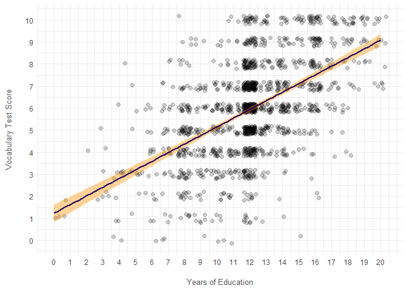

## Part 1.

-   Load the ‘divorce_margarine’ dataset from the ‘dslabs’ package.

``` r
dataset.divorce_margarine <- dslabs::divorce_margarine
dataset.divorce_margarine
```

    ## # A tibble: 10 × 3
    ##    divorce_rate_maine margarine_consumption_per_capita  year
    ##                 <dbl>                            <dbl> <int>
    ##  1                5                                8.2  2000
    ##  2                4.7                              7    2001
    ##  3                4.6                              6.5  2002
    ##  4                4.4                              5.3  2003
    ##  5                4.3                              5.2  2004
    ##  6                4.1                              4    2005
    ##  7                4.2                              4.6  2006
    ##  8                4.2                              4.5  2007
    ##  9                4.2                              4.2  2008
    ## 10                4.1                              3.7  2009

-   Investigate the correlation between margarine consumption and
    divorce rates in Maine.

``` r
ggplot(dataset.divorce_margarine, aes(x = margarine_consumption_per_capita, y = divorce_rate_maine)) +
  geom_point(size = 3) +
  geom_smooth(method = "lm", formula = y ~ x, color = COLORS[5], fill = COLORS[4]) +
  labs(
    x = "Margarine Consumption per Capita",
    y = "Divorce Rate in Maine",
  )
```


``` r
lm(
  data = dataset.divorce_margarine,
  formula = divorce_rate_maine ~ margarine_consumption_per_capita,
) %>% summary()
```

    ## 
    ## Call:
    ## lm(formula = divorce_rate_maine ~ margarine_consumption_per_capita, 
    ##     data = dataset.divorce_margarine)
    ## 
    ## Residuals:
    ##     Min      1Q  Median      3Q     Max 
    ## -0.0558 -0.0182 -0.0145  0.0360  0.0462 
    ## 
    ## Coefficients:
    ##                                  Estimate Std. Error t value Pr(>|t|)    
    ## (Intercept)                       3.30863    0.04803    68.9  2.2e-12 ***
    ## margarine_consumption_per_capita  0.20139    0.00874    23.1  1.3e-08 ***
    ## ---
    ## Signif. codes:  0 '***' 0.001 '**' 0.01 '*' 0.05 '.' 0.1 ' ' 1
    ## 
    ## Residual standard error: 0.0384 on 8 degrees of freedom
    ## Multiple R-squared:  0.985,  Adjusted R-squared:  0.983 
    ## F-statistic:  532 on 1 and 8 DF,  p-value: 1.33e-08

Modelling the divorce rate in Maine as a linear function of margarine
consumption per capita yields a *R*<sup>2</sup>-coefficient of 0.985,
seemingly indicating that more than 98% of the variation in divorce
rates is accounted for by variation in margarine consumption.

-   Would an increase in the preference for margarine lead to
    skyrocketing divorce rates?

Trusting the model naïvely would lead to the implication that increased
margarine consumption would *cause* an increase in divorce rates in
Maine. However, it seems much more likely that this is a case of
spurious correlation, where a statistical relationship has arisen from
random natural variations, such that margarine consumption does not, in
fact, have any (direct) influence on divorce rates in Maine.

## Part 2.

-   Load the ‘GSSvocab’ dataset from the ‘car’ package. This dataset
    contains people’s scores on an English vocabulary test and includes
    demographic information.

``` r
dataset.car <- carData::GSSvocab
dataset.car
```

    ## # A tibble: 28,867 × 8
    ##    year  gender nativeBorn ageGroup educGroup vocab   age  educ
    ##    <fct> <fct>  <fct>      <fct>    <fct>     <dbl> <dbl> <dbl>
    ##  1 1978  female yes        50-59    12 yrs       10    52    12
    ##  2 1978  female yes        60+      <12 yrs       6    74     9
    ##  3 1978  male   yes        30-39    <12 yrs       4    35    10
    ##  4 1978  female yes        50-59    12 yrs        9    50    12
    ##  5 1978  female yes        40-49    12 yrs        6    41    12
    ##  6 1978  male   yes        18-29    12 yrs        6    19    12
    ##  7 1978  male   yes        18-29    12 yrs        4    19    12
    ##  8 1978  male   yes        50-59    12 yrs        7    59    12
    ##  9 1978  female yes        40-49    16 yrs        8    49    16
    ## 10 1978  male   yes        18-29    12 yrs        3    21    12
    ## # ℹ 28,857 more rows

-   Filter for the year 1978 and remove rows with missing values (the
    function na.exclude() is one way to do this – check out the
    documentation!).

``` r
dataset.car.1978 <- dataset.car %>% 
  subset(year == 1978) %>% 
  drop_na()
dataset.car.1978
```

    ## # A tibble: 1,477 × 8
    ##    year  gender nativeBorn ageGroup educGroup vocab   age  educ
    ##    <fct> <fct>  <fct>      <fct>    <fct>     <dbl> <dbl> <dbl>
    ##  1 1978  female yes        50-59    12 yrs       10    52    12
    ##  2 1978  female yes        60+      <12 yrs       6    74     9
    ##  3 1978  male   yes        30-39    <12 yrs       4    35    10
    ##  4 1978  female yes        50-59    12 yrs        9    50    12
    ##  5 1978  female yes        40-49    12 yrs        6    41    12
    ##  6 1978  male   yes        18-29    12 yrs        6    19    12
    ##  7 1978  male   yes        18-29    12 yrs        4    19    12
    ##  8 1978  male   yes        50-59    12 yrs        7    59    12
    ##  9 1978  female yes        40-49    16 yrs        8    49    16
    ## 10 1978  male   yes        18-29    12 yrs        3    21    12
    ## # ℹ 1,467 more rows

-   Is a person’s score on the vocabulary test (‘vocab’) significantly
    impacted by their level of education (‘educ’)? Visualize the
    relationship in a plot and build a model. Briefly explain the
    results.

``` r
ggplot() +
  geom_point(
    data = dataset.car.1978, 
    aes(x = educ, y = vocab), 
    size = 2, 
    alpha = 0.2,
    position = position_jitter(width = 0.4, height = 0.2), 
  ) +
  geom_smooth(
    data = dataset.car.1978, 
    aes(x = educ, y = vocab),
    method = "lm", 
    formula = y ~ x, 
    color = COLORS[5], 
    fill = COLORS[4],
  ) +
  scale_x_continuous(breaks = seq(0, 20)) +
  scale_y_continuous(breaks = seq(0, 10)) +
  labs(
    x = "Years of Education",
    y = "Vocabulary Test Score",
  )
```



``` r
lm(
  data = dataset.car.1978, 
  formula = vocab ~ educ,
) %>% summary()
```

    ## 
    ## Call:
    ## lm(formula = vocab ~ educ, data = dataset.car.1978)
    ## 
    ## Residuals:
    ##    Min     1Q Median     3Q    Max 
    ## -7.123 -1.161  0.054  1.092  5.624 
    ## 
    ## Coefficients:
    ##             Estimate Std. Error t value Pr(>|t|)    
    ## (Intercept)   1.2357     0.1996    6.19  7.7e-10 ***
    ## educ          0.3925     0.0161   24.44  < 2e-16 ***
    ## ---
    ## Signif. codes:  0 '***' 0.001 '**' 0.01 '*' 0.05 '.' 0.1 ' ' 1
    ## 
    ## Residual standard error: 1.89 on 1475 degrees of freedom
    ## Multiple R-squared:  0.288,  Adjusted R-squared:  0.288 
    ## F-statistic:  597 on 1 and 1475 DF,  p-value: <2e-16

Modelling the vocabulary test score as a linear function of level of
education indicates that for each additional year of education, we
would, all else being equal, predict an increase in vocabulary test
score of 0.39, while an individual with 0 education is predicted to
score 1.84 on the vocabulary test. However, the relationship is somewhat
diffuse with a modest 29% of co-variation being explained by the model.

-   Whether a person is the native of an English-speaking country
    (‘nativeBorn’) could potentially have an impact on the size of their
    vocabulary. Visualize the relationship and add the predictor to the
    model. Briefly explain the results.

``` r
ggplot(dataset.car.1978) +
  stat_histinterval(aes(vocab, y = nativeBorn, fill = nativeBorn), alpha = 0.6, na.rm = TRUE, breaks = seq(0, 11), align = 0.5) +
  scale_fill_manual(breaks = c("no", "yes"), labels =  c("Native", "Second Language"), values = COLORS[5:4]) +
  scale_y_discrete(labels = c("Second Language", "Native")) +
  coord_cartesian(ylim = c(1.5, 2)) +
  scale_x_continuous(breaks = seq(0, 10)) +
  guides(fill="none") +
  labs(
    x = "Vocabulary Test Score",
    y = "",
  )
```


``` r
lm(
  data = dataset.car.1978, 
  formula = vocab ~ educ + nativeBorn,
) %>% summary()
```

    ## 
    ## Call:
    ## lm(formula = vocab ~ educ + nativeBorn, data = dataset.car.1978)
    ## 
    ## Residuals:
    ##    Min     1Q Median     3Q    Max 
    ## -7.162 -1.201  0.015  1.231  5.803 
    ## 
    ## Coefficients:
    ##               Estimate Std. Error t value Pr(>|t|)    
    ## (Intercept)      0.628      0.277    2.27   0.0233 *  
    ## educ             0.392      0.016   24.50   <2e-16 ***
    ## nativeBornyes    0.650      0.205    3.16   0.0016 ** 
    ## ---
    ## Signif. codes:  0 '***' 0.001 '**' 0.01 '*' 0.05 '.' 0.1 ' ' 1
    ## 
    ## Residual standard error: 1.88 on 1474 degrees of freedom
    ## Multiple R-squared:  0.293,  Adjusted R-squared:  0.292 
    ## F-statistic:  306 on 2 and 1474 DF,  p-value: <2e-16

It seems that, on average, native speakers score slightly higher on the
vocabulary test but vocabulary scores are more uniformly distributed for
non-natives, such that the non-natives are more likely to score either
very lowly or very highly.

The linear model would suggest that being a native increases the
predicted vocabulary test score by 0.65, although this didn’t really
notably increase the proportion of variance explained.

-   Does a person’s level of education depend on whether they are a
    native of the country? Visualize the relationship.

``` r
ggplot(dataset.car.1978) +
  stat_histinterval(aes(educ, y = nativeBorn, fill = nativeBorn), alpha = 0.6, na.rm = TRUE, breaks = seq(0, 21), align = 0.5) +
  scale_fill_manual(breaks = c("no", "yes"), labels =  c("Native", "Second Language"), values = COLORS[5:4]) +
  scale_y_discrete(labels = c("Second Language", "Native")) +
  coord_cartesian(ylim = c(1.5, 2)) +
  scale_x_continuous(breaks = seq(0, 20)) +
  guides(fill="none") +
  labs(
    x = "Years of Education",
    y = "",
  )
```


-   Do you think it makes sense to add the relationship as an
    interaction term? Try creating the model and briefly explain the
    results.

The level of education does not seem to depend on whether one is a
native or not. The distributions of education levels don’t differ in any
meaningful way.

``` r
lm(
  data = dataset.car.1978, 
  formula = vocab ~ educ * nativeBorn,
) %>% summary()
```

    ## 
    ## Call:
    ## lm(formula = vocab ~ educ * nativeBorn, data = dataset.car.1978)
    ## 
    ## Residuals:
    ##    Min     1Q Median     3Q    Max 
    ## -7.155 -1.205  0.015  1.235  5.986 
    ## 
    ## Coefficients:
    ##                    Estimate Std. Error t value Pr(>|t|)    
    ## (Intercept)          0.3539     0.6878    0.51     0.61    
    ## educ                 0.4151     0.0550    7.55  7.4e-14 ***
    ## nativeBornyes        0.9500     0.7186    1.32     0.19    
    ## educ:nativeBornyes  -0.0250     0.0575   -0.44     0.66    
    ## ---
    ## Signif. codes:  0 '***' 0.001 '**' 0.01 '*' 0.05 '.' 0.1 ' ' 1
    ## 
    ## Residual standard error: 1.88 on 1473 degrees of freedom
    ## Multiple R-squared:  0.293,  Adjusted R-squared:  0.292 
    ## F-statistic:  204 on 3 and 1473 DF,  p-value: <2e-16

By adding an interaction term between nativeness and education, the
model finds that, if anything, the effect of education on vocabulary
score seems to be marginally smaller for natives, although the parameter
estimate is highly uncertain and does not rule out the opposite
scenario, i.e. that the effect is in fact larger for natives.

-   Which model performs best?

While adding nativeness and its interaction with education did
marginally improve the proportion of variance explained, the interaction
term did not allow for better prediction. Thus, the model using years of
education as well as nativeness as predictors seems to be the most
useful model in this instance.

This is also the conclusion arrived at if one were to consult an ANOVA
model comparison:

``` r
anova(
  lm(
    data = dataset.car.1978, 
    formula = vocab ~ educ,
  ),
  lm(
    data = dataset.car.1978, 
    formula = vocab ~ educ + nativeBorn,
  ),
  lm(
    data = dataset.car.1978, 
    formula = vocab ~ educ * nativeBorn,
  )
)
```

    ## # A tibble: 3 × 6
    ##   Res.Df   RSS    Df `Sum of Sq`      F `Pr(>F)`
    ##    <dbl> <dbl> <dbl>       <dbl>  <dbl>    <dbl>
    ## 1   1475 5242.    NA      NA     NA     NA      
    ## 2   1474 5206.     1      35.4   10.0    0.00159
    ## 3   1473 5206.     1       0.670  0.189  0.663

-   When creating plots, try to play around with the options of ggplot2
    – add titles and axis labels, and consider using colours.

✔
